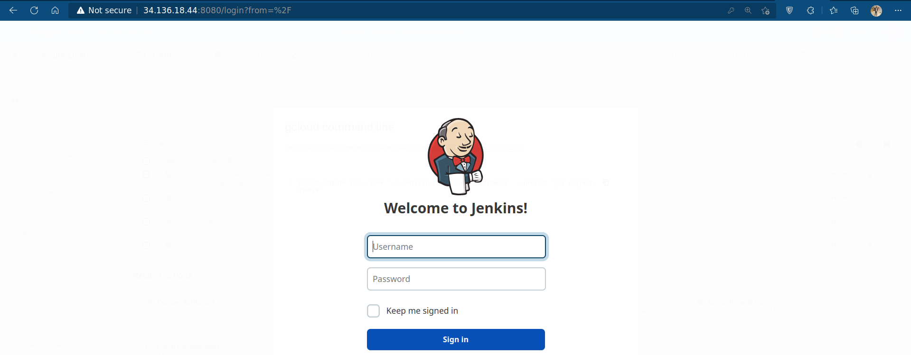

- ### Here I am deploying on the GKE node , we used the bastion to access the k8s cluster
- ### jen-deployment.yaml file has a jenkins container image runs on the private cluster
- ### I did a load balancer service to acces the private pod
- ### also I add a persistent volume to keep the data saved even if the pod destroyed
- ### service account is made for pods to make them able to manipulate on the cluster objects
```bash
amir@terraform-instance:~$ kubectl get all
W0802 23:35:59.693412   29390 gcp.go:120] WARNING: the gcp auth plugin is deprecated in v1.22+, unavailable in v1.25+; use gcloud instead.
To learn more, consult https://cloud.google.com/blog/products/containers-kubernetes/kubectl-auth-changes-in-gke
NAME                          READY   STATUS    RESTARTS   AGE
pod/jenkins-75547b7d5-6prjj   1/1     Running   0          7h31m

NAME                   TYPE           CLUSTER-IP    EXTERNAL-IP    PORT(S)          AGE
service/jenkins        LoadBalancer   10.52.1.147   34.136.18.44   8080:31243/TCP   9h
service/jenkins-jnlp   ClusterIP      10.52.9.17    <none>         50000/TCP        9h

NAME                      READY   UP-TO-DATE   AVAILABLE   AGE
deployment.apps/jenkins   1/1     1            1           7h31m

NAME                                DESIRED   CURRENT   READY   AGE
replicaset.apps/jenkins-75547b7d5   1         1         1       7h31m

```

